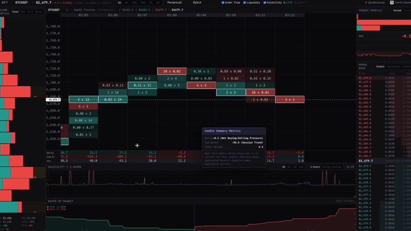

# Order Flow Tracker

**Production-ready, open-source, real-time crypto market-data screening terminal.**

> ⚡ Live footprint charts · Order book · OBI · Volume Profile · Depth of Market · Volatility Z-Score



---

## What This Is

A professional **market-data and order-flow screener** for crypto perpetuals and spot markets.

**This is NOT a trading application.** There is:
- ❌ No trading
- ❌ No order execution  
- ❌ No buy/sell buttons
- ❌ No broker integration
- ❌ No portfolio management

Users **observe**, **analyze**, **compare** and **screen** live market data.

---

## Supported Exchanges

### Perpetuals
| Exchange | Status |
|----------|--------|
| Binance Futures | ✅ Live |
| Bybit Futures | ✅ Live |
| OKX Futures | ✅ Live |
| Bitget Futures | ✅ Live |
| Hyperliquid | ✅ Live |
| Deribit | ✅ Live |

### Spot
| Exchange | Status |
|----------|--------|
| Binance Spot | ✅ Live |
| Bybit Spot | ✅ Live |
| OKX Spot | ✅ Live |
| Bitget Spot | ✅ Live |
| Coinbase Spot | ✅ Live |

---

## Features

### Footprint Chart
- Price × Time × Executed Volume visualization
- Bid/Ask volume at every price level
- Per-level delta (askVol - bidVol)
- Imbalance highlighting (3x threshold, configurable)
- Z-score volume emphasis (subtle border highlighting)
- Stacked imbalance detection
- Canvas-rendered for performance (no DOM elements per cell)

### Order Book
- Live bid/ask levels with cumulative depth bars
- Single venue / Aggregated / Compact modes
- Spread display

### OBI (Order Book Imbalance)
- Current OBI value: -1 (ask-heavy) → 0 (balanced) → +1 (bid-heavy)
- Historical OBI chart with fill gradient

### Volume Profile & Trades Profile
- Horizontal volume profile by price
- Total / Buy / Sell / Delta tabs
- POC, VAH, VAL identification
- Executed trade distribution by price

### Depth of Market & Volatility
- Cumulative bid/ask depth curve
- Rolling Z-score of trade volume
- Color-coded: ±1 (yellow), ±2 (orange), ±3 (red)
- Configurable rolling windows: 20, 50, 100, 200


---

## How to Use It

1. **Select an Asset and Venue:** Use the Top Bar to select whether you want to analyze Spot or Perpetual markets, select your target asset (e.g. BTCUSDT), and choose the specific exchange.
2. **Customize Your Workspace:** Click on the tabs in the Top Bar to toggle modules on/off (Order Book, Volume Profile, OBI, Volatility, DOM).
3. **Analyze Data:** Hover over any data point on the terminal—whether on the footprint chart, the DOM, or the profiles—to read a detailed tooltip explaining exactly what the data means.
4. **Resize Panels:** Adjust the screen layout by dragging the borders between panels to fit your specific trading/screening setup.

---

## How to Contribute

We welcome contributions from the community! If you're a developer or designer who wants to improve Order Flow Tracker:

1. **Fork the Repository:** Start by forking the project to your own GitHub account.
2. **Clone Locally:** `git clone https://github.com/your-username/order-flow-tracker.git`
3. **Create a Branch:** Create a feature branch (`git checkout -b feature/amazing-feature`).
4. **Make Changes:** Add your new exchange adapter, indicator, or UI improvement.
5. **Run Tests:** Ensure you haven't broken the engine logic by running `npm test`.
6. **Submit a Pull Request:** Push to your fork and submit a PR to the main repository.

If you find a bug or have a feature request, please open an issue in the GitHub repository. 

---

## Future Updates 🚀

We are actively working on this project! Order Flow Tracker is still evolving, and we will be introducing even more updates, features, and refinements in the future. Stay tuned for advanced cross-venue aggregation, more analytical modules, and further UI polish.

---

## Getting Started (Development)

```bash
# Install dependencies
npm install

# Run development server
npm run dev

# Run tests
npm test
```

Open [http://localhost:3000](http://localhost:3000).

---

## Architecture & Tech Stack

**Tech:** Next.js 16, React 19, TypeScript, Tailwind CSS 4, Zustand, Canvas API.
**Data:** Live WebSocket exchange feeds normalized through our engine.

```
Exchange WebSockets → Exchange Adapters → Order Flow Engine → Zustand Store → React Components
```

---

## License

Apache 2.0
